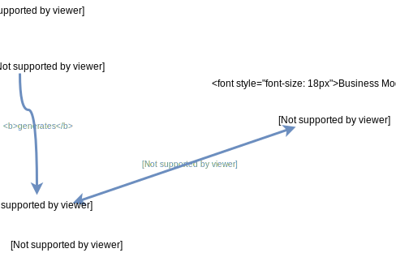
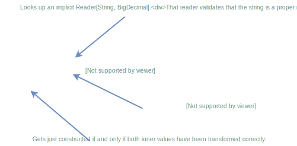
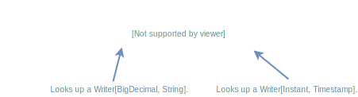

# teleproto

[](https://search.maven.org/search?q=teleproto_2.13)

The tele**proto** library reduces the boilerplate required to map case classes generated from [Protofiles](https://developers.google.com/protocol-buffers/docs/proto3)
using [ScalaPB](https://github.com/scalapb/ScalaPB) to corresponding version-independent business model case classes.

The library is intended for the use case outlined below:
* An application/service works on an evolving *business model* with some semantics. 
* *Protofiles* model the transfer of that business model in the current and previous version.
* *ScalaPB* is used to generate case classes for the protocol buffers model. 



Depending on the specific use case it is necessary to define readers and/or writers to convert between the business model
and the current or a previous protocol buffers model.
Reading/writing for the current protocol buffers model should be straightforward.
Reading/writing a previous model should reflect similar semantics regarding the current business model.

**For now** the library supports mapping of matching models and therefore for the parts of models that have not changed
in an evolution. That reduces the code required to support previous versions (and a lot of code to support the current version, too...). 

## Mapping DSL

The library defines abstractions for both directions: `Reader[PROTO, MODEL]` and `Writer[MODEL, PROTO]`.
Readers/writers are converters between the business model and Protocol Buffers model from the business model user's perspective.

It is assumed that a writer can never fail and if it fails it fails with a **5xx Internal Server Error**.
But a client cannot be trusted and therefore a `Reader[PROTO, MODEL]` produces either a `PbSuccess(model: MODEL)` or a
`PbFailure` containing some explanation.

The DSL defines combinators to create mappings between *case classes* which are generated for *messages* in protofiles.
Those combinators are based on `implicit` readers/writers for the inner types of those case classes.


To read/write between `v1.Price` and `Price` conversions for `amount` and `time` are required
which are wrapped by decomposition of the input model and construction of the output model.

### Reader

A reader converts a Protocol Buffers value to a business model values or fails with an error message.



The readers are best constructed using a `for` loop. Since reading of inner values could fail the whole read should fail
if one of them fails.  
`transform` is used if neither the types are optional.
`required` is used if the type is optional in Protocol Buffers like Google's `Timestamp` wrapper and not optional in
the business model.
`optional` would be used if both types are optional.  
These three helpers are defined on the `Reader` companion.

The readers for the inner type are implicitly available in the `Reader` companion.

### Writer

A writer is much simpler since in cannot fail converting a business model value to a Protocol Buffers value, never ;-)



`present` on the `Writer` companion is the counterpart for `Reader.required`.

## Generated Mappings

The mappings for standard messages defined in Protofiles that have been compiled into case classes by ScalaPB are
somewhat similar and boilerplate. Therefore those mappings can be generated.  
The library contains Scala [Def Macros](https://docs.scala-lang.org/overviews/macros/overview.html) to generate readers
and writers for simple mappings.

### messages: case classes to case classes

For a `message` in a Protofile ScalaPB generates a `case class`.
That class can be mapped to a compatible business model `case class` with the same field names.

```
package v1

case class ServiceClass(                 case class ServiceClass(             
  ...                                      ...             
) extends GeneratedMessage {             )
  ...                                   
}                                                     
                                     
case class ServiceArea(                  case class ServiceArea(
  id: String,                              id: String,
  taxRate: String,                         taxRate: BigDecimal,
  lastUpdate: Option[Timestamp],           lastUpdate: Instant,
  serviceClasses: Seq[ServiceClass]        serviceClasses: List[ServiceClass]
  ...                                      ...
) extends GeneratedMessage {             )
  ...
}
```

For the Protocol Buffers and business model case classes above a mapping can generated:

```
implicit val reader: Reader[v1.ServiceArea, ServiceArea] = ProtocolBuffers.reader[v1.ServiceArea, ServiceArea]
implicit val writer: Writer[ServiceArea, v1.ServiceArea] = ProtocolBuffers.writer[ServiceArea, v1.ServiceArea]
```

The methods on `ProtocolBuffes` are macros that create a reader/writer for the specified case classes or fail if they
are not compatible.

The reader macro deals with unwrapping `Timestamp` before converting it to an `Instant`. It handles the conversion of
the `Seq` into the collection type `List`. The writer macro handles the counterpart.

To read the inner fields the following implicit readers are required (for the writer respectively):

* `Reader[String, String]` *trivial and available in the `Reader` companion*
* `Reader[String, BigDecimal]` *available in the `Reader` companion*
* `Reader[Timestamp, Instant]` *available in the `Reader` companion*
* `Reader[v1.ServiceClass, ServiceClass]` ***not** available by default*

There is no reader from `v1.ServiceClass` to `ServiceClass` since these are not a library classes.  
To provide that implicit one can either code a custom reader or generate a reader using the macro.  
But one may also omit the implicit in this case: if no implicit reader for `ServiceClass` is available in the scope of
the reader macro for `ServiceRegion`, the macro will create the reader for `ServiceClass`, too. That is, the macro
supports hierarchical types. It will generate readers for not yet mapped parts of the hierarchy if a reader can be
generated for those parts. The user just has to provide implicit readers for the types that cannot be generated.

**Please note:** This will not work for recursive case classes.

### oneofs: sealed traits to sealed traits

In the definition of business models in Scala `sealed traits` are used quite often to model different options:

```
sealed trait Calculation
case class Error(message: String) extends Calculation
case class Success(result: BigDecimal) extends Calculation
```

There are several options to map that to definitions in Protocol Buffers and each has some mismatch.
Protofiles know the concept of `oneof` which is more a *union* of types than a type hierarchy.
Therefore a `oneof` named `calculation` with options `error` and `success` cannot be reused.
The `oneof` must be defined in each position a `Calculation` occurs.

Take for example the following Protofile definition:

```
message Result {
  message Error {
    String message = 1;
  }
  message Success {
    String result = 1;
  }
  oneof Calculation {
    Error error = 1;
    Success success = 2;
  }  
}
```

The case classes generated by ScalaPB are quite complex but can be mapped automatically:

```
package v1

case class Result(calculation: Result.Calculation)
object Result {
  case class Error(message: String)
  case class Success(result: String)

  sealed trait Calculation
  object Calculation {
    case object Empty extends Calculation
    case class Error(error: Result.Error) extends Calculation
    case class Success(success: Result.Success) extends Calculation
  }
}
```

**Please note:**
* The generated code is much larger and the code above is reduced to the important part of the structure.
* There is no relationship between `Result.Error` and `Result.Success` in PB since they are just plain messages.
  The only connection is defined by the `oneof` which results in the classes of the `trait Calculation`.
* Since everything is somewhat optional in PB an `Empty` object is added to the trait by ScalaPB.

The reader/writer macros can map the generated objects/traits/case classes to the business model trait (and its case
classes). The reader will reject `Empty` with a `PbFailure` and read the content of the other two constructors.  
Similar to the mapping of case classes the reader/writer requires implicit readers/writers for the inner types (`Error` and `Success`).
One can either define them or let the macro generate them, too.

**Please note:** This will not work for recursive trait types. case objects would be empty messages and are also not supported.

Example usage:
```
sealed trait Calculation
case class Error(message: String) extends Calculation
case class Success(result: BigDecimal) extends Calculation

implicit val errorReader: Reader[v1.Error, Error] = ProtocolBuffers.reader[v1.Error, Error]
implicit val errorWriter: Writer[Error, v1.Error] = ProtocolBuffers.writer[Error, v1.Error]

implicit val successReader: Reader[v1.Success, Success] = ProtocolBuffers.reader[v1.Success, Success]
implicit val successWriter: Writer[Success, v1.Success] = ProtocolBuffers.writer[Success, v1.Success]

implicit val calculationReader: Reader[v1.Calculation, Calculation] = ProtocolBuffers.reader[v1.Calculation, Calculation]
implicit val calculationWriter: Writer[Calculation, v1.Calculation] = ProtocolBuffers.writer[Calculation, v1.Calculation]
```

## Special Mappings

The `Reader`/`Writer` companions already define some conversions:
* `BigDecimal` in business model, `String` in PB 
* `Instant` in business model, `Timestamp` in PB
* ... *(look into the source code)* 

If a mapping generation is not possible one has to define reader/writer programmatically.
Usually, a mapping cannot be generated for generic types in the business model due to the *impedance
mismatch* between PB's and Scala's types.

## Evolutions and (In-)Compatibility

Protocol Buffers are meant for evolution.
Readers can be *backward compatible* (able to read older stuff) or not, writers can be *forward compatible* (writes
stuff that can be read by older readers) or not.

The reader macro analyzes the structure of both case classes and types, respectively. It detects incompatibility or
backward compatibility:

```
package v23                              // business model matching v42

case class SomeModel(                    case class SomeModel(
  id: String,                              id: String,
  taxRate: String,
                                           lastUpdate: Option[Instant],
  customers: Int,                          customers: List[Customer],
                                           comment: String = "no comment",
                                           correlationId: Long
) extends GeneratedMessage {             )
  ...
}
```

* `taxRate` is surplus in the input, ignored in the mapping and declares the mapping to be *backward compatible*. 
* `lastUpdate` is missing in the input but is optional, will be set to `None` and declares the mapping to be *backward compatible*. 
* `comment` is missing in the input but has a default value and declares the mapping to be *backward compatible*. 
* `correlationId` is missing in the input, is not optional, has no default value and causes the whole reader to be
  considered *incompatible*.

**Please note:** `customers` looks incompatible but is actually considered compatible!
It *just* requires an implicit `Reader[Int, List[Customer]]`.
Defining local implicit readers/writers from older to new types is a strategy for migrations using this library.

The forward compatibility of writers is symmetric: Surplus fields in the business model declare the mapping to be
forward compatible. By default all values in ScalaPB generated classes have default values.
Therefore most of the writers are considered forward compatible. Actually, just a new case class in a trait mappings can
cause a writer to be incompatible.

Generating a backward/forward compatible reader/writer using the macro will raise a **warning**.
Annotations `@backward("signature")` and `@forward("signature")` (signatures are explained in the warning) will remove
the warning. 

The support of migrations is currently limited to implicit readers/writers of old Protocol Buffers types to the new
business model wherever possible.
Other breaking changes are not yet supported but the library limits the need for coded readers/writers to the parts of
the model that actually changed.

## License

This code is open source software licensed under the [Apache 2.0 License](http://www.apache.org/licenses/LICENSE-2.0.html).

## Publishing (for maintainers)

To publish a release to Maven Central follow these steps:

1. Create a tag/release on GitHub
2. Publish the artifact to the OSS Sonatype stage repository:
   ```
   sbt +publishSigned
   ```  
   Note that your Sonatype credentials need to be configured on your machine and you need to have access writes to publish artifacts to the group id `io.moia`.
3. Release artifact to Maven Central with:
   ```
   sbt +sonatypeRelease
   ```
